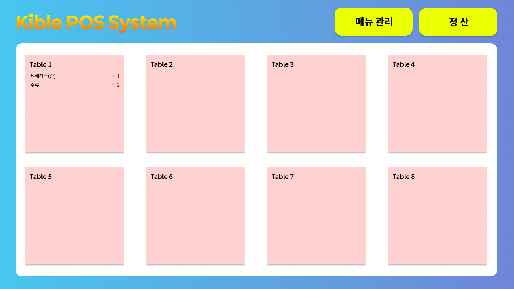
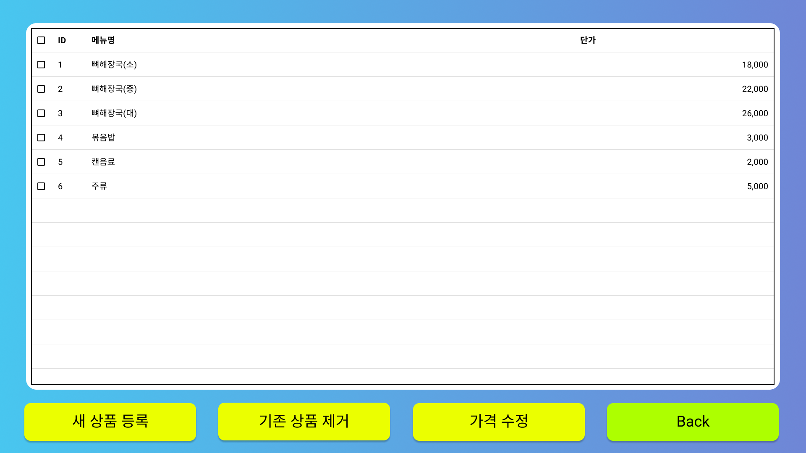
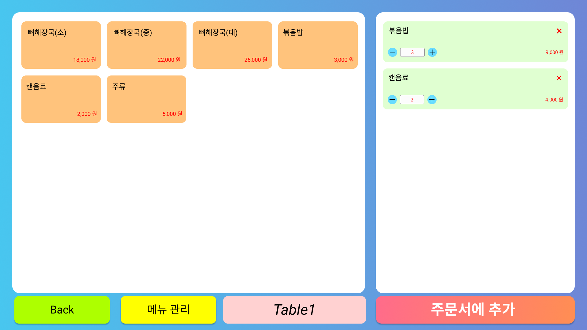
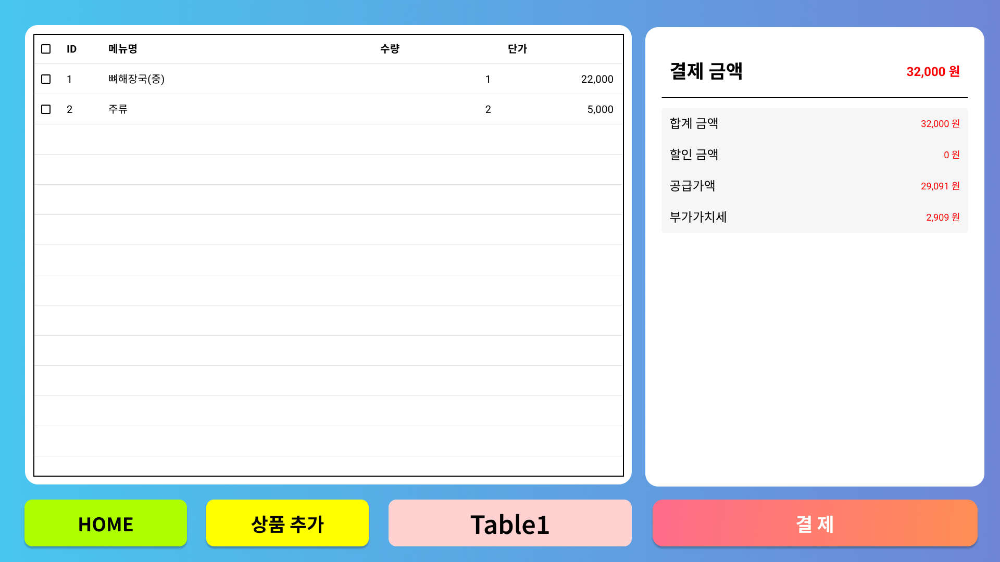
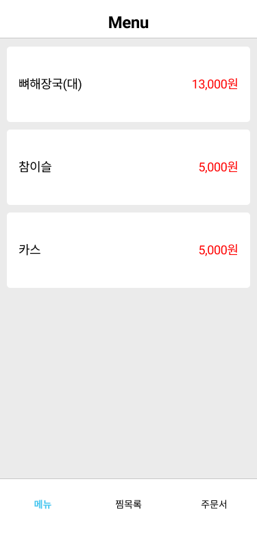
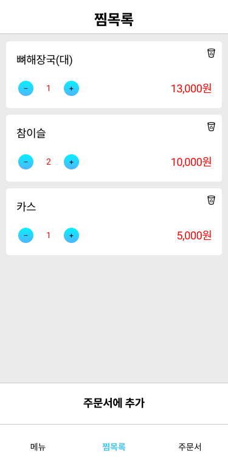
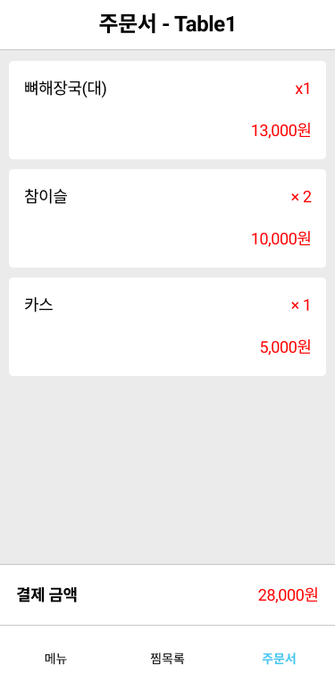
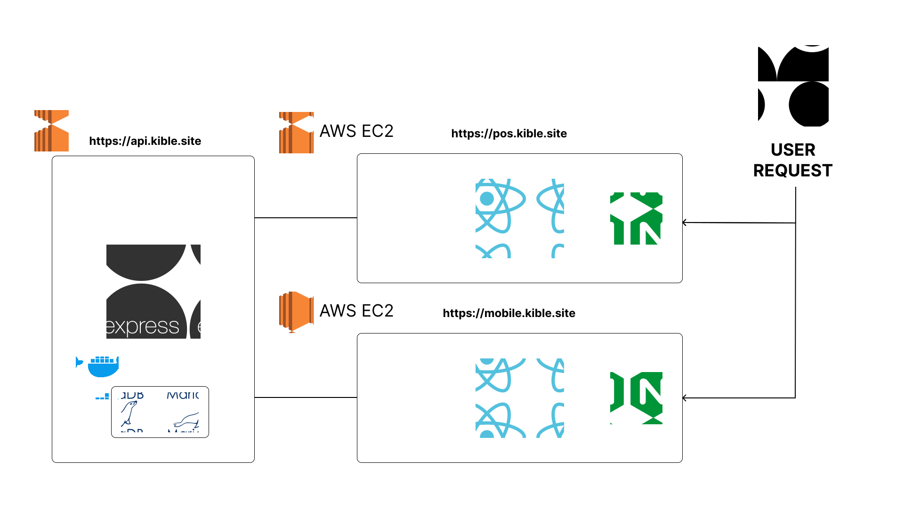

# Kible: 음식점 QR-Code 모바일 주문 시스템

**고객이 QR-Code로 모바일 주문하고 점주가 POS로 실시간 관리할 수 있는 음식점용 통합 시스템 구축**

 

## Repositories

### Kible POS

[**GitHub Link**](https://github.com/KibleLab/kible-pos/tree/legacy)

### Kible Mobile

[**GitHub Link**](https://github.com/rwr9857/kible-mobile-legacy)

### Kible Server

[**GitHub Link**](https://github.com/KibleLab/kible-server/tree/legacy)

 

## Overview

- **프로젝트명:** Kible: 음식점 QR-Code 모바일 주문 시스템
- **목표**: 고객이 QR-Code로 모바일 주문하고 점주가 POS로 실시간 관리할 수 있는 음식점용 통합 시스템 구축
- **작업기간**: 2021-01-01 ~ 2021-11-26
- **기여도**: 50%
- **총 인원**: 2명

## Preview

### POS UI

<table width="100%">
  <tr>
    <th width="50%" align="center">POS 메인화면</th>
    <th width="50%" align="center">메뉴 관리 화면</th>
  </tr>

  <tr>
    <td align="center">
      
    </td>
    <td align="center">
      
    </td>
  </tr>
  <tr>
    <th align="center">메뉴 선택 및 찜목록(카트) 화면</th>
    <th align="center">주문서 및 결제 화면</th>
  </tr>
  <tr>
    <td align="center">
      
    </td>
    <td align="center">
      
    </td>
  </tr>
</table>

### Mobile UI

<table width="100%">
  <tr>
    <th width="33.3%" align="center">메뉴 선택 화면</th></th>
    <th width="33.3%" align="center">찜목록(카트) 화면</th>
    <th width="33.3%" align="center">주문서 화면</th>
  </tr>
  
  <tr>
    <td align="center">
      
    </td>
    <td align="center">
      
    </td>
    <td align="center">
      
    </td>
  </tr>
</table>

 

## Server RestAPI

<table width="100%" style="border-collapse: collapse; font-family: sans-serif; font-size: 14px;">
  <thead>
    <tr style="border-bottom: 2px solid #000;">
      <th style="padding: 12px; text-align: left; font-weight: 900;">Domain</th>
      <th style="padding: 12px; text-align: center; font-weight: 900;">Method</th>
      <th style="padding: 12px; text-align: left; font-weight: 900;">Endpoint</th>
      <th style="padding: 12px; text-align: left; font-weight: 900;">Description</th>
    </tr>
  </thead>
  <tbody>
    <tr style="border-bottom: 1px solid #eee;">
      <td rowspan="2" style="padding: 12px; font-weight: bold; background-color: #fafafa;">TableMgnt</td>
      <td style="padding: 12px; text-align: center;">GET</td>
      <td style="padding: 12px;"><code>/api/table-mgnt</code></td>
      <td style="padding: 12px;">전체 테이블 목록 조회</td>
    </tr>
    <tr style="border-bottom: 1px solid #eee;">
      <td style="padding: 12px; text-align: center;">POST</td>
      <td style="padding: 12px;"><code>/api/table-mgnt</code></td>
      <td style="padding: 12px;">테이블 정보 등록 (table_no, table_name)</td>
    </tr>
    <tr style="border-bottom: 1px solid #eee;">
      <td rowspan="2" style="padding: 12px; font-weight: bold; background-color: #fafafa;">MenuMgnt</td>
      <td style="padding: 12px; text-align: center;">GET</td>
      <td style="padding: 12px;"><code>/api/menu-mgnt</code></td>
      <td style="padding: 12px;">전체 메뉴 관리 목록 조회 (가격, 재고 포함)</td>
    </tr>
    <tr style="border-bottom: 1px solid #eee;">
      <td style="padding: 12px; text-align: center;">SOCKET</td>
      <td style="padding: 12px;"><code>/api/menu-mgnt</code></td>
      <td style="padding: 12px;">메뉴 관리 조회 시 실시간 이벤트 전송 (GET /api/menu-mgnt Success)</td>
    </tr>
    <tr style="border-bottom: 1px solid #eee;">
      <td rowspan="5" style="padding: 12px; font-weight: bold; background-color: #fafafa;">MenuSlct</td>
      <td style="padding: 12px; text-align: center;">GET</td>
      <td style="padding: 12px;"><code>/api/menu-slct</code></td>
      <td style="padding: 12px;">전체 메뉴 목록 조회 (가격, 재고 포함)</td>
    </tr>
    <tr style="border-bottom: 1px solid #eee;">
      <td style="padding: 12px; text-align: center;">SOCKET</td>
      <td style="padding: 12px;"><code>/api/menu-slct</code></td>
      <td style="padding: 12px;">메뉴 조회 시 실시간 이벤트 전송 (GET /api/menu-slct Success)</td>
    </tr>
    <tr style="border-bottom: 1px solid #eee;">
      <td style="padding: 12px; text-align: center;">POST</td>
      <td style="padding: 12px;"><code>/api/menu-slct</code></td>
      <td style="padding: 12px;">메뉴 등록 (이름, 가격, 재고)</td>
    </tr>
    <tr style="border-bottom: 1px solid #eee;">
      <td style="padding: 12px; text-align: center;">PATCH</td>
      <td style="padding: 12px;"><code>/api/menu-slct</code></td>
      <td style="padding: 12px;">메뉴 재고 수정</td>
    </tr>
    <tr style="border-bottom: 1px solid #eee;">
      <td style="padding: 12px; text-align: center;">DELETE</td>
      <td style="padding: 12px;"><code>/api/menu-slct</code></td>
      <td style="padding: 12px;">메뉴 삭제</td>
    </tr>
    <tr style="border-bottom: 1px solid #eee;">
      <td rowspan="6" style="padding: 12px; font-weight: bold; background-color: #fafafa;">WishList</td>
      <td style="padding: 12px; text-align: center;">GET</td>
      <td style="padding: 12px;"><code>/api/wishlist/{table}</code></td>
      <td style="padding: 12px;">특정 테이블의 위시리스트 목록 조회</td>
    </tr>
    <tr style="border-bottom: 1px solid #eee;">
      <td style="padding: 12px; text-align: center;">SOCKET</td>
      <td style="padding: 12px;"><code>/api/wishlist</code></td>
      <td style="padding: 12px;">위시리스트 조회 시 실시간 이벤트 전송 (GET /api/wishlist Success)</td>
    </tr>
    <tr style="border-bottom: 1px solid #eee;">
      <td style="padding: 12px; text-align: center;">POST</td>
      <td style="padding: 12px;"><code>/api/wishlist/{table}</code></td>
      <td style="padding: 12px;">테이블에 메뉴 추가 (기본 수량 1)</td>
    </tr>
    <tr style="border-bottom: 1px solid #eee;">
      <td style="padding: 12px; text-align: center;">PATCH</td>
      <td style="padding: 12px;"><code>/api/wishlist/{table}</code></td>
      <td style="padding: 12px;">위시리스트 메뉴 수량 변경</td>
    </tr>
    <tr style="border-bottom: 1px solid #eee;">
      <td style="padding: 12px; text-align: center;">DELETE</td>
      <td style="padding: 12px;"><code>/api/wishlist/{table}</code></td>
      <td style="padding: 12px;">특정 메뉴 삭제</td>
    </tr>
    <tr style="border-bottom: 1px solid #eee;">
      <td style="padding: 12px; text-align: center;">DELETE</td>
      <td style="padding: 12px;"><code>/api/wishlist/reset/{table}</code></td>
      <td style="padding: 12px;">테이블 위시리스트 전체 초기화</td>
    </tr>
    <tr style="border-bottom: 1px solid #eee;">
      <td rowspan="5" style="padding: 12px; font-weight: bold; background-color: #fafafa;">OrderSheet</td>
      <td style="padding: 12px; text-align: center;">GET</td>
      <td style="padding: 12px;"><code>/api/ordersheet/{table}</code></td>
      <td style="padding: 12px;">특정 테이블의 주문 목록 조회</td>
    </tr>
    <tr style="border-bottom: 1px solid #eee;">
      <td style="padding: 12px; text-align: center;">SOCKET</td>
      <td style="padding: 12px;"><code>/api/ordersheet</code></td>
      <td style="padding: 12px;">주문 조회 시 실시간 이벤트 전송 (GET /api/ordersheet Success)</td>
    </tr>
    <tr style="border-bottom: 1px solid #eee;">
      <td style="padding: 12px; text-align: center;">POST</td>
      <td style="padding: 12px;"><code>/api/ordersheet/{table}</code></td>
      <td style="padding: 12px;">테이블에 주문 메뉴 추가</td>
    </tr>
    <tr style="border-bottom: 1px solid #eee;">
      <td style="padding: 12px; text-align: center;">PATCH</td>
      <td style="padding: 12px;"><code>/api/ordersheet/{table}</code></td>
      <td style="padding: 12px;">주문 메뉴 수량 변경</td>
    </tr>
    <tr style="border-bottom: 1px solid #eee;">
      <td style="padding: 12px; text-align: center;">DELETE</td>
      <td style="padding: 12px;"><code>/api/ordersheet/{table}</code></td>
      <td style="padding: 12px;">테이블 주문 내역 전체 삭제</td>
    </tr>
    <tr style="border-bottom: 1px solid #eee;">
      <td rowspan="5" style="padding: 12px; font-weight: bold; background-color: #fafafa;">DailySales</td>
      <td style="padding: 12px; text-align: center;">GET</td>
      <td style="padding: 12px;"><code>/api/dailysales</code></td>
      <td style="padding: 12px;">일일 메뉴별 판매 내역 조회 (총 매출 포함)</td>
    </tr>
    <tr style="border-bottom: 1px solid #eee;">
      <td style="padding: 12px; text-align: center;">SOCKET</td>
      <td style="padding: 12px;"><code>/api/dailysales</code></td>
      <td style="padding: 12px;">일일 매출 조회 시 실시간 이벤트 전송 (GET /api/dailysales Success)</td>
    </tr>
    <tr style="border-bottom: 1px solid #eee;">
      <td style="padding: 12px; text-align: center;">POST</td>
      <td style="padding: 12px;"><code>/api/dailysales</code></td>
      <td style="padding: 12px;">메뉴별 일일 판매 수량 등록</td>
    </tr>
    <tr style="border-bottom: 1px solid #eee;">
      <td style="padding: 12px; text-align: center;">PATCH</td>
      <td style="padding: 12px;"><code>/api/dailysales</code></td>
      <td style="padding: 12px;">메뉴별 일일 판매 수량 수정</td>
    </tr>
    <tr style="border-bottom: 1px solid #eee;">
      <td style="padding: 12px; text-align: center;">DELETE</td>
      <td style="padding: 12px;"><code>/api/dailysales</code></td>
      <td style="padding: 12px;">일일 매출 데이터 전체 초기화</td>
    </tr>
  </tbody>
</table>

 

## ER-Diagram

## Architecture

## Team

<table border="1">
  <tr>
    <td align="center"></td>
    <td align="left">이현준 PM, FullStack, UI/UX설계, 문서화</td>
  </tr>
  <tr>
    <td align="center"></td>
    <td align="left">김준기 UI/UX 설계, ERD 설계   Front-End : 70% Back-End : 20% 기여     자료조사(리액트 프레임워크 사용법 등)</td>
  </tr>
</table>

 

## Background

### 현황

- 대다수의 패스트푸드점이나 카페 같은 곳에서는 COVID-19를 기점으로 Kiosk를 확충함.
- 일반음식점은 테이블에서 태블릿을 활용하여 주문하는 시스템이 보급되고 있음.

### 기존 시스템의 문제점

- 테이블에서 태블릿을 활용하여 주문하는 시스템의 경우, 점주의 입장에서 관리 및 비용적인 부분에 많은 투자를 필요로 함.
- 네이버 주문과 같은 서비스의 경우 이 프로젝트와 맥락은 같으나, 식사를 하면서 추가 주문을 하고, 최종적으로 결제를 하게 되는 일반음식점의 환경과 맞지 않음.

### 목표

- QR코드를 스캔하여 모바일로 주문할 수 있는 Mobile 환경 제작
- 주문을 실시간으로 수신하고, 관리할 수 있는 POS 시스템 제작
- Mobile과 POS 간의 양방향 실시간 통신 및 데이터 관리를 위한 Sever 제작

 

## Timeline

### 선행 연구 (1~2월)

- React Library
- Express Framework
- Object Relational Mapping

### 프로젝트 설계 (3~4월)

- UI/UX 설계
- ERD 설계
- Back-end Architecture 설계
- Front-end Architecture 설계

### 프로젝트 구현 (5~8월)

- 목업 데이터 구현
- Front-end(POS, Mobile) 구현
- Back-end 구현
- FE, BE 간 HTTP 통신 구현
- Logging 구현

### 실시간 통신 구현 및 배포 (9~10월)

- 실시간 통신 (WebSocket, Socket.IO) 선행 연구
- FE, BE 간 Socket.IO 통신 구현
- AWS EC2에 NGINX로 Reverse Proxy 및 SSL 적용하여 배포
- DataBase를 Docker를 사용하여 AWS EC2에 배포

### 유지보수 및 관리 (11월~)

- QA 및 버그 수정
- 의존성 업데이트 관리
- 배포 서버 보안 관리
