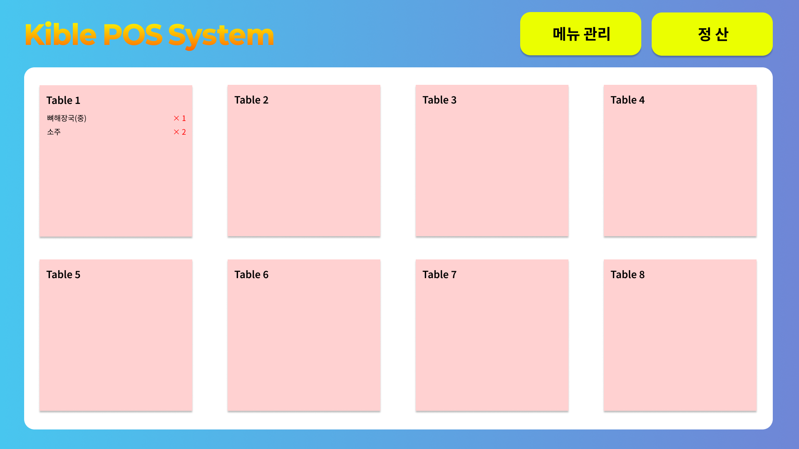
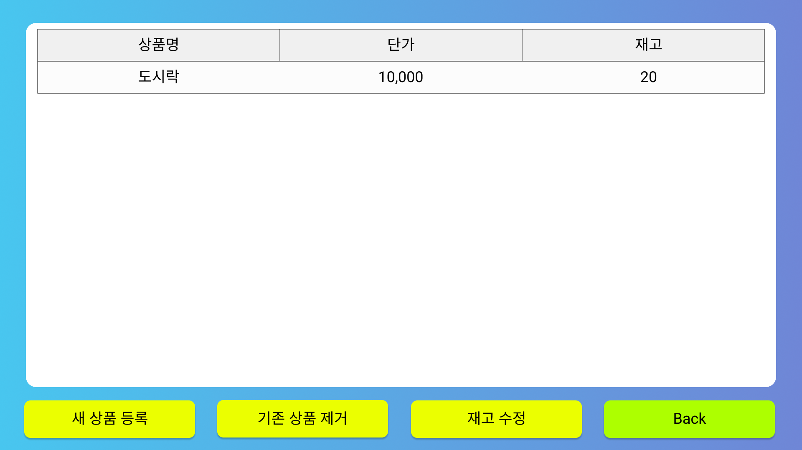
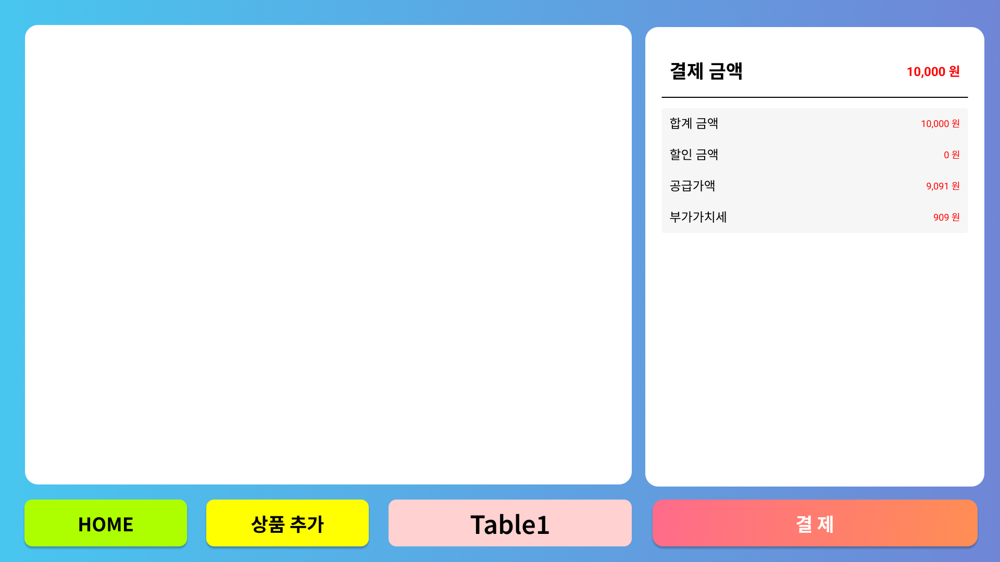
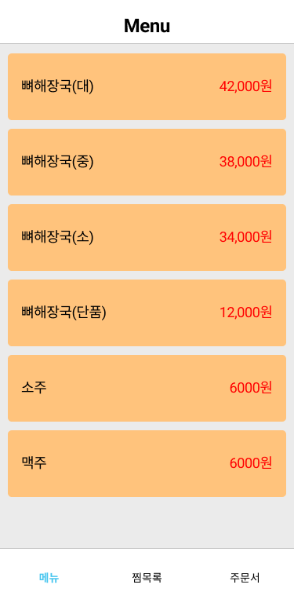
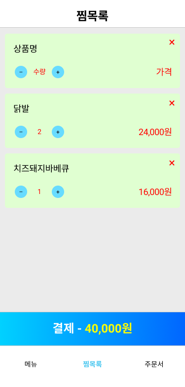
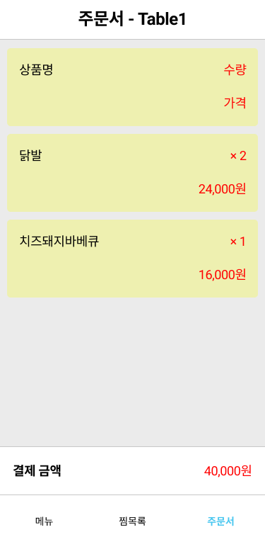

# 프로젝트 명 : [Kible] POS & Kiosk

**QR 코드를 스캔하여 모바일로 주문하는 일반 음식점용 주문 시스템**

> 테이블에 비치된 QR 코드를 통해 고객은 개인 모바일로 주문하고,  
> 점주는 POS를 통해 주문을 실시간으로 관리할 수 있는 시스템

---

## Repositories (v1)

### POS (Web)
[`@release/pos-v1`](https://github.com/KibleLab/kible/tree/@release/pos-v1)

       

---

### Mobile (Web)
[`@release/mobile-v1`](https://github.com/KibleLab/kible/tree/@release/mobile-v1)

       

---

### Back-end
[`@release/be-v1`](https://github.com/KibleLab/kible/tree/@release/be-v1)

     

---

## Overview

- **프로젝트명**: Kible  
- **도메인**: 일반 음식점용 QR 주문 시스템  
- **버전**: v1  
- **제작 기간**: 2021.01 ~ 2021.11  

---
## POS UI Preview

> 점주가 사용하는 POS 관리 화면 (v1)

  
  &nbsp;&nbsp;&nbsp;
  

  
  &nbsp;&nbsp;&nbsp;
  

### 화면 설명
- **메인 화면**: 테이블별 주문 현황 실시간 확인
- **메뉴 관리**: 상품 등록, 삭제 및 가격 설정
- **메뉴 선택**: POS기 고객 주문 및 수량 선택
- **결제**: 주문 내역 확인 및 결제

## Mobile UI Preview

> 고객이 사용하는 모바일 주문 화면 (v1)

  
  &nbsp;&nbsp;&nbsp;
  
  &nbsp;&nbsp;&nbsp;
  

### 화면 설명
- **메뉴**: 음식 메뉴 조회 및 가격 확인
- **찜목록**: 선택한 메뉴 수량 조절 및 삭제
- **주문서**: 테이블 단위 주문 내역 확인 및 결제 금액 표시

## Team

<table border="1">
  <tr>
    <td align="center">         </td> 
    <td align="left">이현준 (팀장) UI/UX설계, FullStack, 문서화</td> </tr> <tr> <td align="center"></td> 
    <td align="left">김준기 (팀원) ERD설계, FullStack, 자료조사</td> 
  </tr> 
</table>

---

## Background & Motivation

### 시장 현황
- COVID-19 이후 비대면 주문 및 키오스크 확산
- 일반 음식점에서는 테이블 태블릿 주문 시스템 보급

### 기존 시스템의 한계
- 태블릿 기반 시스템의 높은 초기 비용 및 유지 관리 부담

### 목표
- QR 코드 기반 모바일 주문 환경 제공
- 실시간 주문 수신·관리 POS 구축
- Mobile ↔ POS 간 양방향 실시간 통신 구현

---

## System Architecture (v1)

- **Mobile**: 고객 주문 UI
- **POS**: 주문 관리 및 상태 처리
- **Back-end**
  - REST API 기반 기본 통신
  - Socket.IO 기반 실시간 주문 이벤트 처리
- **Infra**
  - AWS EC2
  - NGINX Reverse Proxy + SSL

---

## Development Timeline

### 선행 연구 (1 ~ 2월)
- React 생태계
- Express Framework
- ORM / TypeORM

### 프로젝트 설계 (3 ~ 4월)
- UI/UX 설계
- ERD 설계
- FE / BE 아키텍처 설계

### 구현 (5 ~ 8월)
- Mock 데이터 구현
- POS / Mobile Front-end 개발
- Back-end API 구현
- HTTP 기반 FE–BE 통신
- Logging 시스템

### 실시간 통신 & 배포 (9 ~ 10월)
- WebSocket / Socket.IO
- AWS EC2 배포
- NGINX Reverse Proxy, SSL

### 유지보수 (11월 ~)
- QA 및 버그 수정
- 의존성 업데이트
- 서버 보안 관리

---

## 📄 License

Copyright © 2021 **KibleLab**
